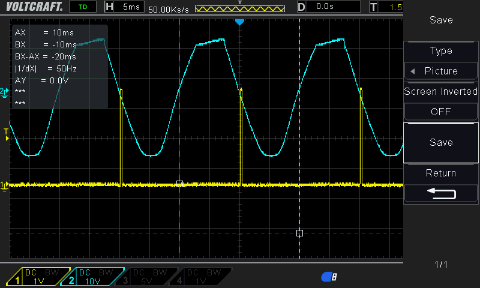

## Arduino Smart Bike Trainer (ASBT in BLE)

### Images from the oscilloscope

1. Sync signal

   This images shows the synchronization signal 23VAC and the rectified signal that goes to the Arduino board:

   
   
2. PWM Signals from +9 to _4

   
   
   
   
   
   
   
   
   
   
   
   
   
   

